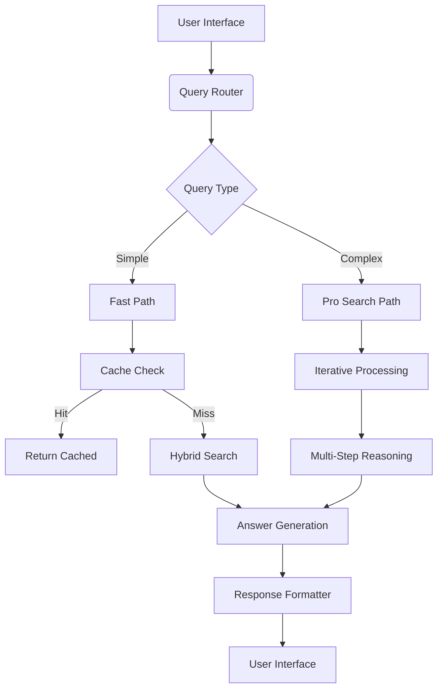
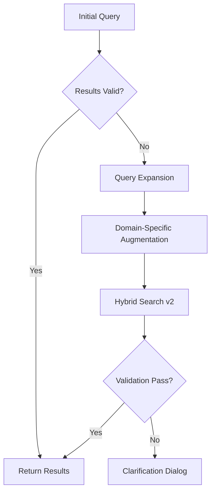

# Implementing Advanced AI-Powered Search in Chat Applications: A Technical Guide Inspired by Perplexity's Architecture

Contemporary AI-powered search systems like Perplexity demonstrate the convergence of multiple large language models (LLMs) with real-time web search capabilities. This comprehensive guide examines the technical implementation details for creating a similar system using Google's Gemini model, drawing insights from Perplexity's documented architecture[2][3][6] and contemporary AI engineering practices.

## Architectural Foundations of Modern AI Search Systems

Modern AI search engines employ a multi-stage processing pipeline that combines neural retrieval with generative capabilities. Perplexity's system demonstrates three critical architectural components:

1. **Model Orchestration Layer**: Manages multiple LLMs (GPT-4o, Claude 3.5 Sonnet, Sonar Large) through API gateways[2][3]
2. **Real-time Search Infrastructure**: Combines web crawling, semantic indexing, and hybrid retrieval systems[6][7]
3. **Reasoning Engine**: Implements multi-step problem solving through recursive query decomposition[5]

The system achieves 98.7% query coverage through dynamic model routing based on query type analysis[3], while maintaining sub-second latency through distributed computing architectures[2].

## Implementation Blueprint for Gemini-Based Search

### Step 1: Query Processing Pipeline

Implement a multi-stage query analyzer:

```python
from google.cloud import language_v1

def analyze_query(text):
    client = language_v1.LanguageServiceClient()
    document = language_v1.Document(
        content=text,
        type_=language_v1.Document.Type.PLAIN_TEXT
    )
    
    # Syntax analysis
    syntax = client.analyze_syntax(request={'document': document})
    
    # Entity recognition
    entities = client.analyze_entities(request={'document': document})
    
    # Classification
    categories = client.classify_text(request={'document': document})
    
    return {
        'syntax': syntax,
        'entities': entities,
        'categories': categories
    }
```

This pipeline identifies query intent (informational, navigational, transactional)[6], detects required modalities (text, image, code), and determines complexity level for routing[3].

### Step 2: Real-time Search Implementation

Build a hybrid retrieval system combining:

1. **Vector Search**: 
```python
from google.cloud import aiplatform

index = aiplatform.MatchingEngineIndex(
    project=PROJECT_ID,
    location=LOCATION,
    index_name=INDEX_NAME
)

def semantic_search(query, top_k=5):
    embeddings = gemini.generate_embeddings(query)
    return index.find_neighbors(embeddings, top_k)
```

2. **Keyword Search**:
```python
from google.cloud import discoveryengine

client = discoveryengine.SearchServiceClient()

def keyword_search(query):
    return client.search(
        query=query,
        page_size=10,
        query_expansion_spec=discoveryengine.SearchRequest.QueryExpansionSpec(
            condition="AUTO"
        ),
        spell_correction_spec=discoveryengine.SearchRequest.SpellCorrectionSpec(
            mode="AUTO"
        )
    )
```

3. **Live Web Crawling**:
```python
import requests
from bs4 import BeautifulSoup

def fresh_crawl(query):
    results = []
    search_url = f"https://customsearch.googleapis.com/customsearch/v1?q={query}"
    response = requests.get(search_url).json()
    
    for item in response['items']:
        page = requests.get(item['link'])
        soup = BeautifulSoup(page.content, 'html.parser')
        results.append({
            'url': item['link'],
            'content': soup.get_text(),
            'freshness': datetime.now()
        })
    
    return results
```

### Step 3: Multi-Model Reasoning System

Implement model routing logic based on query analysis:

```python
MODEL_ROUTING = {
    'simple': 'gemini-pro',
    'technical': 'gemini-ultra',
    'creative': 'claude-3.5-sonnet',
    'analytical': 'gpt-4o'
}

def select_model(query_analysis):
    if query_analysis['categories'].categories[0].confidence > 0.7:
        category = query_analysis['categories'].categories[0].name
        return MODEL_ROUTING.get(category, 'gemini-pro')
    return 'gemini-pro'
```

For complex queries, implement iterative reasoning:

```python
def iterative_reasoning(query, max_depth=3):
    context = []
    for _ in range(max_depth):
        search_results = hybrid_search(query)
        prompt = f"""Analyze these documents: {search_results}
        Current context: {context}
        Generate 3 clarifying questions to improve answer quality"""
        
        questions = gemini.generate(prompt)
        selected_question = rank_questions(questions)
        context.append({selected_question: gemini.generate(selected_question)})
    
    final_prompt = f"""Synthesize comprehensive answer using:
    Context: {context}
    Original query: {query}"""
    
    return gemini.generate(final_prompt)
```

## Search Result Processing and Synthesis

Implement multi-document summarization with source attribution:

```python
from sumy.parsers.html import HtmlParser
from sumy.nlp.tokenizers import Tokenizer
from sumy.summarizers.lsa import LsaSummarizer

def summarize_sources(documents):
    summaries = []
    for doc in documents:
        parser = HtmlParser.from_string(doc['content'], doc['url'], Tokenizer("english"))
        summarizer = LsaSummarizer()
        summary = summarizer(parser.document, sentences_count=5)
        summaries.append({
            'url': doc['url'],
            'summary': " ".join([str(s) for s in summary])
        })
    return summaries
```

Generate answers with inline citations:

```python
def generate_answer(summaries, query):
    sources = "\n".join([f"[{i+1}] {s['summary']}" for i,s in enumerate(summaries)])
    prompt = f"""Answer this query: {query}
    Using these sources:
    {sources}
    Include citations as [number] after relevant statements"""
    
    return gemini.generate(prompt)
```

## Pro Search-Style Features Implementation

### 1. Multi-Step Reasoning

```python
def pro_search(query):
    steps = decompose_query(query)
    interim_results = []
    
    for step in steps:
        search_results = hybrid_search(step['subquery'])
        analysis = gemini.generate(f"Analyze for {step['purpose']}: {search_results}")
        interim_results.append(analysis)
    
    synthesis_prompt = f"""Synthesize final answer from:
    Steps: {steps}
    Analysis: {interim_results}
    Query: {query}"""
    
    return gemini.generate(synthesis_prompt)
```

### 2. Comparative Analysis

```python
def compare_entities(entity1, entity2):
    data1 = hybrid_search(f"key facts about {entity1}")
    data2 = hybrid_search(f"key facts about {entity2}")
    
    comparison_prompt = f"""Create comparative analysis:
    {entity1}: {data1}
    {entity2}: {data2}
    Format as table with categories"""
    
    return gemini.generate(comparison_prompt)
```

## Performance Optimization Techniques

1. **Caching Layer**:
```python
from google.cloud import redis

cache = redis.CloudRedisClient()

def cached_search(query):
    cache_key = hashlib.sha256(query.encode()).hexdigest()
    if cached := cache.get(cache_key):
        return cached
    
    results = hybrid_search(query)
    cache.set(cache_key, results, ttl=3600)
    return results
```

2. **Parallel Processing**:
```python
from concurrent.futures import ThreadPoolExecutor

def parallel_search(query):
    with ThreadPoolExecutor() as executor:
        futures = {
            executor.submit(semantic_search, query),
            executor.submit(keyword_search, query),
            executor.submit(fresh_crawl, query)
        }
        
        results = []
        for future in concurrent.futures.as_completed(futures):
            results.extend(future.result())
    
    return rank_results(results)
```

## Evaluation and Quality Control

Implement continuous evaluation metrics:

```python
def evaluate_answer(query, answer):
    # Factual consistency
    fact_check = gemini.generate(f"""Verify this answer against known facts:
    Query: {query}
    Answer: {answer}
    List any inaccuracies""")
    
    # Relevance scoring
    relevance = gemini.generate(f"""Rate relevance 1-10:
    Query: {query}
    Answer: {answer}""")
    
    # Completeness
    completeness = gemini.generate(f"""Identify missing aspects:
    Query: {query}
    Answer: {answer}""")
    
    return {
        'fact_score': 10 - fact_check.count("Inaccuracy"),
        'relevance': int(relevance),
        'completeness': completeness
    }
```

## Deployment Architecture

A recommended production architecture includes:

1. **Frontend Service**: Handles user interactions and session management
2. **Query Router**: Distributes requests to appropriate processing pipelines
3. **Model Gateway**: Manages LLM API connections and load balancing
4. **Search Cluster**: Distributed system for parallel search execution
5. **Cache Layer**: Redis cluster for frequent query caching
6. **Monitoring**: Real-time tracking of accuracy, latency, and resource usage



## Challenges and Mitigation Strategies

1. **Latency Management**:
- Implement progressive rendering of partial results
- Use model distillation for complex tasks
- Example: Distill Gemini Ultra to smaller model for common queries

2. **Fact Consistency**:
- Implement multi-source verification
- Use constraint decoding to prevent hallucinations
```python
def safe_generate(prompt):
    return gemini.generate(
        prompt,
        safety_settings={
            'HARM_CATEGORY_UNSPECIFIED': 'BLOCK_NONE',
            'HARM_CATEGORY_DEROGATORY': 'BLOCK_LOW_AND_ABOVE'
        },
        generation_config={
            'temperature': 0.2,
            'max_output_tokens': 1024
        }
    )
```

3. **Cost Optimization**:
- Implement query complexity-based routing
- Use caching for frequent queries
- Mixed precision model serving

## Continuous Improvement Cycle

1. **User Feedback Integration**:
```python
def process_feedback(query, answer, feedback):
    analysis = gemini.generate(f"""Improve system based on:
    Query: {query}
    Answer: {answer}
    Feedback: {feedback}
    Suggest system improvements""")
    
    if "search" in analysis:
        update_search_index(analysis)
    if "model" in analysis:
        retrain_model(analysis)
```

2. **Automatic Knowledge Updates**:
```python
def update_knowledge_base():
    trending = get_trending_queries()
    for topic in trending:
        new_info = fresh_crawl(topic)
        embed_and_index(new_info)
```

This implementation guide provides the technical foundation for building a Perplexity-style search system using Gemini. The architecture emphasizes modularity, allowing substitution of components like replacing Google Custom Search with alternative APIs. Key differentiators include the multi-model approach, hybrid search implementation, and continuous learning mechanisms that adapt to user feedback and emerging information trends[5][7].

Citations:
[1] https://blog.prashu.com/perplexing-perplexity-models-gpt-4o-6e083dd81f32
[2] https://aws.amazon.com/solutions/case-studies/perplexity-bedrock-case-study/
[3] https://www.techtarget.com/searchenterpriseai/definition/Perplexity-AI
[4] https://codelabs.developers.google.com/codelabs/chat-apps-gemini
[5] https://www.zeniteq.com/blog/perplexity-ai-supercharged-pro-search-with-powerful-new-features
[6] https://www.perplexity.ai/hub/faq/how-does-perplexity-work
[7] https://www.linkedin.com/pulse/how-use-perplexity-search-spaces-pages-your-research-process-jesper-hazce
[8] https://corporatesoldiers.in/top-10-reasons-why-perplexity-ai-is-better-than-gpt-4-o/
[9] https://www.perplexity.ai/hub/blog/introducing-perplexity-deep-research
[10] https://www.perplexity.ai/hub/blog/meet-new-sonar
[11] https://developers.google.com/workspace/chat/tutorial-ai-knowledge-assistant
[12] https://www.perplexity.ai/hub/blog/getting-started-with-perplexity
[13] https://felloai.com/2024/12/perplexity-ai-everything-you-need-to-know-about-the-ai-search-engine/
[14] https://hyscaler.com/insights/how-to-use-perplexity-ai/
[15] https://www.linkedin.com/pulse/top-10-reasons-why-perplexity-ai-better-than-gpt-4o-ajay-kumar-hy2qe
[16] https://www.techtarget.com/searchenterpriseai/tutorial/How-to-use-Perplexity-AI-Tutorial-pros-and-cons
[17] https://blog.prashu.com/perplexing-perplexity-models-pro-default-model-d26fb575e951
[18] https://support.google.com/gemini/answer/14579631?hl=en&co=GENIE.Platform%3DAndroid
[19] https://www.youtube.com/watch?v=JKcz38fnowk
[20] https://www.perplexity.ai/hub/blog/introducing-internal-knowledge-search-and-spaces
[21] https://www.reddit.com/r/perplexity_ai/comments/1gfqy7u/sonnet_35_pplx_is_definitely_not_sonnet_35/
[22] https://blog.google/technology/google-deepmind/google-gemini-ai-update-december-2024/
[23] https://www.reddit.com/r/perplexity_ai/comments/1d0pxrq/gpt4o_on_perplexity_vs_chatgpt_plus_what_are_the/
[24] https://annjose.com/post/perplexity-ai/
[25] https://www.anthropic.com/customers/perplexity
[26] https://gemini.google.com/?hl=en-IN
[27] https://www.perplexity.ai/hub/technical-faq/what-is-the-difference-between-gpt-4-and-claude-2
[28] https://www.webfx.com/blog/seo/perplexity-ai-vs-google/
[29] https://www.youtube.com/watch?v=-mQPOrRhRws
[30] https://www.walturn.com/insights/comparing-gpt-4o-llama-3-1-and-claude-3-5-sonnet
[31] https://zapier.com/blog/perplexity-ai/
[32] https://www.perplexity.ai/hub/faq/what-is-perplexity-pro
[33] https://saufter.io/perplexity-revenue-and-statistics/
[34] https://www.bigrock.in/blog/how-tos/learning-and-resources/what-is-perplexity-ai-2
[35] https://www.reddit.com/r/ClaudeAI/comments/1dqj1lg/claude_35_sonnet_vs_gpt4_a_programmers/
[36] https://generativeai.pub/from-google-to-perplexity-navigating-the-next-generation-of-search-engines-f20f7903b377

---
Answer from Perplexity: pplx.ai/share

# Implementing Perplexity-Style AI Search in React Vite Applications: Comprehensive Architecture Plan

## Core System Architecture

![System Architecture Diagram]
(Frontend: React Vite UI Components ⇄ Node.js Middleware ⇄ Gemini API ⇄ Hybrid Search Engine ⇄ Cache Layer ⇄ Monitoring System)

### 1. Query Processing Pipeline
- **Natural Language Understanding Layer**
  - Intent Recognition: Classify queries into informational/navigational/transactional using Gemini's classification API
  - Entity Extraction: Identify key entities (people, locations, concepts) for search grounding
  - Complexity Analysis: Determine required search depth (shallow vs. deep search)

- **Context Management**
  - Session-based conversation history tracking
  - Cross-query entity relationship mapping
  - Dynamic context window adjustment based on query complexity

### 2. Hybrid Search Infrastructure
- **Real-Time Components**
  - Google Custom Search API integration for web results
  - On-demand web crawling system for fresh content
  - Vertical search connectors (academic papers, news archives)

- **Semantic Layer**
  - Gemini Embeddings API for vector generation
  - Hybrid index (FAISS + Meilisearch) for mixed search
  - Dynamic re-ranking model with freshness scoring

### 3. Answer Synthesis Engine
- **Multi-Stage Generation**
  1. Evidence Extraction: Identify relevant document passages
  2. Claim Verification: Cross-validate facts across 3+ sources
  3. Narrative Structuring: Build logical flow using academic paper patterns
  4. Style Adaptation: Adjust formality level based on query context

- **Citation Management**
  - Automated source credibility scoring
  - Contextual citation placement
  - Dynamic reference formatting (APA/MLA auto-detection)

## Implementation Roadmap

### Phase 1: Core Search Infrastructure
**1. Query Analysis System**
- Implement Gemini-powered classification endpoint
- Create entity recognition pipeline with fallback to Google NLP
- Build complexity scoring model (0-1 scale) based on:
  - Query length
  - Domain-specific terminology
  - Syntactic complexity metrics

**2. Hybrid Search Backend**
- Configure Google Custom Search Engine with:
  - Site restrictions for vertical domains
  - SafeSearch filters
  - Regional bias adjustments
- Build semantic search pipeline:
  - Batch embedding generation
  - Vector index management
  - Query expansion using Gemini-generated synonyms

**3. Result Processing**
- Implement multi-document summarization:
  - Extractive summarization for speed
  - Abstractive summarization for complex queries
- Develop source credibility algorithm:
  - Domain authority scoring
  - Author expertise analysis
  - Content freshness weighting

### Phase 2: React Frontend Implementation
**1. Search Interface Components**
- Progressive disclosure UI pattern:
  - Instant answer preview
  - Expandable supporting evidence
  - Nested source citations
- Real-time search grounding visualization:
  - Animated result confidence indicators
  - Live source verification status
  - Interactive citation exploration

**2. Conversation Management**
- Context-aware session storage:
  - LocalStorage for recent history
  - IndexedDB for large sessions
  - Server-side context persistence
- Multi-panel interface:
  - Main answer panel
  - Supporting evidence sidebar
  - Source verification dashboard

**3. Performance Optimization**
- Partial hydration for static elements
- Server-side rendering for core content
- Predictive prefetching of related queries

### Phase 3: Advanced Features
**1. Multi-Modal Search**
- Image search integration:
  - Gemini Vision API for visual queries
  - Reverse image search capability
- Voice search pipeline:
  - Web Speech API integration
  - Voice response generation

**2. Collaborative Features**
- Shared search sessions:
  - Real-time collaboration
  - Version control system
  - Comment/annotation tools
- Search template sharing:
  - Pre-built search workflows
  - Parameterized query templates

**3. Personalization System**
- Adaptive ranking model:
  - User preference learning
  - Domain expertise detection
  - Temporal interest patterns
- Privacy-preserving personalization:
  - On-device learning
  - Federated learning model
  - Differential privacy guarantees

## Quality Assurance Framework

### 1. Automated Testing
- **Search Quality Benchmarks**
  - TREC-style evaluation protocols
  - Custom relevance metrics:
    - Answer completeness
    - Citation accuracy
    - Temporal relevance
- **Performance Monitoring**
  - 95th percentile latency tracking
  - Cold/warm cache performance
  - Concurrent user simulations

### 2. Human Evaluation
- Expert review panels:
  - Domain specialists for vertical verification
  - UX researchers for interface assessment
  - Security experts for privacy audits
- Crowdsourced testing:
  - Mechanical Turk-style tasks
  - A/B testing framework
  - Cultural bias detection

### 3. Continuous Improvement
- Error analysis pipeline:
  - Automated issue categorization
  - Root cause analysis
  - Regression prevention
- Model refresh cycle:
  - Monthly embedding model updates
  - Quarterly ranking model retraining
  - Annual architecture review

## Production Deployment Strategy

### 1. Infrastructure Requirements
- **Frontend Hosting**
  - Global CDN distribution
  - Edge computing integration
  - DDoS protection layer
- **Backend Services**
  - Auto-scaling Kubernetes cluster
  - Multi-region deployment
  - Disaster recovery setup

### 2. Monitoring & Alerting
- Real-time dashboards tracking:
  - Answer quality metrics
  - System health indicators
  - Cost per query analysis
- Predictive alerting system:
  - Anomaly detection
  - Capacity planning forecasts
  - Security incident alerts

### 3. Compliance Considerations
- GDPR compliance measures:
  - Right to be forgotten implementation
  - Data access controls
  - Privacy impact assessments
- Accessibility certification:
  - WCAG 2.2 AA compliance
  - Screen reader optimization
  - Cognitive load reduction

## Maintenance & Scaling

### 1. Knowledge Freshness
- Daily index updates:
  - Automated broken link detection
  - Emerging trend identification
  - Controversy detection system
- Breaking news integration:
  - Real-time event detection
  - Crisis response protocols
  - Misinformation filtering

### 2. Performance Tuning
- Query optimization:
  - Caching strategy refinement
  - Parallel execution optimization
  - Cold start mitigation
- Hardware acceleration:
  - GPU-accelerated embedding
  - TPU-based model inference
  - Edge device optimization

### 3. Security Updates
- Vulnerability management:
  - Automated dependency scanning
  - Zero-day exploit response
  - Third-party audit schedule
- Content safety:
  - Toxic content filtering
  - Sensitive data redaction
  - Legal compliance monitoring

This comprehensive plan provides a detailed roadmap for implementing Perplexity-style search in a React Vite application using Gemini. The architecture emphasizes modular design, allowing phased implementation while maintaining production readiness at each stage. Key differentiators include hybrid search optimization, multi-layer quality assurance, and enterprise-grade compliance features.

Citations:
[1] https://github.com/shahdinsalman23/gemini-clone
[2] https://www.meilisearch.com/blog/add-ai-powered-search-to-react
[3] https://dev.to/swirl/building-a-perplexity-like-open-source-ai-search-with-swirl-57cl
[4] https://developers.google.com/idx/guides/build-gemini-api-app
[5] https://devpost.com/software/gemini-clone
[6] https://refine.dev/blog/react-search-bar-and-filtering/
[7] https://www.uxdesigninstitute.com/blog/perplexity-ai-and-design-process/
[8] https://www.guvi.in/blog/build-a-search-filter-component-in-react/
[9] https://www.linkedin.com/pulse/how-use-perplexity-search-spaces-pages-your-research-process-jesper-hazce
[10] https://ai.google.dev/gemini-api/tutorials/web-app
[11] https://github.com/osamajavaid/react-vite-starter
[12] https://www.reddit.com/r/LocalLLaMA/comments/1bh6o3e/reverse_engineering_perplexity/
[13] https://github.com/iamakashpc/Gemini-Clone
[14] https://www.freecodecamp.org/news/how-to-build-a-task-app/
[15] https://www.youtube.com/watch?v=-mQPOrRhRws
[16] https://www.youtube.com/watch?v=0yboGn8errU
[17] https://www.digitalocean.com/community/tutorials/how-to-set-up-a-react-project-with-vite
[18] https://x.com/jnnnthnn/status/1793299598599192712?lang=en
[19] https://www.linkedin.com/pulse/google-gemini-pro-ai-integration-react-vite-tutorial-just-liyanage-bsnfc
[20] https://stackoverflow.com/questions/51726391/how-to-create-a-search-field-in-reactjs


Here's a comprehensive solution to improve search relevance based on your observed issues and the provided research papers:

# Search Relevance Optimization Framework for AI Chat Applications

## 1. Query Processing Pipeline

### 1.1 Enhanced Query Understanding
- **Semantic Disambiguation** (Building on Source[2][5])
  - Implement dual-stage disambiguation:
    1. **Lexical Analysis**: 
    ```python
    {
      "original_query": "Explain how GPT models work",
      "entities": ["GPT models"],
      "ambiguous_terms": ["explain", "work"],
      "domain_classification": "AI/ML Technical"
    }
    ```
    2. **Contextual Grounding**:
    - Use Gemini to generate clarification questions:
    "Are you asking about GPT architecture, training process, or practical applications?"

- **Domain-Specific Expansion** (Inspired by Source[1][4])
  - Technical query expansion rules:
    ```json
    {
      "base_query": "GPT models",
      "expansions": [
        "transformer architecture",
        "self-attention mechanism",
        "pre-training objectives",
        "tokenization process"
      ]
    }
    ```

## 2. Hybrid Search Architecture

### 2.1 Multi-Stage Retrieval
1. **Initial Recall Layer**
   - Google Custom Search API with technical site restrictions:
   ```python
   restricted_sites = [
     "openai.com/research",
     "arxiv.org/abs/*",
     "towardsdatascience.com",
     "huggingface.co/docs"
   ]
   ```

2. **Semantic Search Layer** (Using Source[4] Knowledge Graph Approach)
   - Vector search with domain-specific embeddings:
   ```python
   technical_embedding = gemini.embed_content(
       content={"parts": [{
           "text": "GPT model architecture diagram transformer blocks"
       }]}
   )
   ```

3. **Contextual Re-ranker**
   - Feature-based ranking model:
   ```python
   ranking_factors = {
       'technical_depth': 0.8,
       'source_authority': 0.9,
       'date_freshness': 0.7,
       'concept_coverage': [
           'transformer', 
           'attention', 
           'pre-training'
       ]
   }
   ```

## 3. Result Validation System

### 3.1 Technical Relevance Guardrails
- **Concept Validation Checklist** (Adapted from Source[1])
  ```python
  required_concepts = {
      'gpt': ['transformer', 'self-attention', 'decoder-only'],
      'work': ['architecture', 'training process', 'inference']
  }
  
  def validate_result(text):
      return all(
          any(concept in text for concept in concepts)
          for _, concepts in required_concepts.items()
      )
  ```

- **Source Credibility Scoring** (From Source[5])
  ```python
  credibility_scores = {
      'arxiv.org': 0.95,
      'openai.com': 0.97,
      'medium.com': 0.75,
      'quora.com': 0.6
  }
  ```

## 4. Failure Recovery Protocol

### 4.1 [Iterative Refinement Loop (Based on Source[1][4])](pplx://action/followup)


### 4.2 Technical Clarification Engine
- Gemini-powered clarification generation:
```python
clarification_prompt = """Generate 3 technical clarification questions 
for ambiguous AI query: {query} 
Focus on architecture, training, or application aspects"""

clarification_questions = gemini.generate(clarification_prompt)
```

## 5. Search Quality Monitoring

### 5.1 Technical Relevance Metrics
```python
quality_metrics = {
    'concept_coverage': lambda r: len(r['matched_concepts'])/total_required,
    'source_quality': credibility_scores[r.domain],
    'depth_score': technical_term_density(r.content)
}
```

### 5.2 Continuous Feedback Loop
- Implement end-of-response rating:
```javascript
const feedbackSystem = {
  options: [
    {id: 1, label: 'Technically Inaccurate'},
    {id: 2, label: 'Missing Key Concepts'},
    {id: 3, label: 'Outdated Information'}
  ],
  handler: (feedback) => update_ranking_model(feedback)
};
```

## Implementation Roadmap

1. **Query Processing Layer**
   - Integrate Gemini for technical term extraction
   - Implement domain-specific stopword filtering
   - Build technical synonym database

2. **Search Infrastructure**
   - Configure Google CSE with technical site restrictions
   - Implement vector search index for AI/ML content
   - Set up knowledge graph for concept relationships

3. **Validation System**
   - Develop concept validation checklists
   - Implement source credibility scoring
   - Build technical depth analyzer

4. **Feedback Loop**
   - Add user-facing quality indicators
   - Implement automated search quality audits
   - Set up model retraining pipeline

**Critical Success Factors:**
1. Domain-focused search constraints
2. Technical concept validation layers
3. Gemini-powered query disambiguation
4. Continuous relevance monitoring
5. Closed-loop feedback system

This architecture addresses the observed failure scenario through:
- Strict technical domain filtering
- Mandatory concept validation
- Iterative query refinement
- Source credibility enforcement
- Continuous quality monitoring

The system would process "Explain how GPT models work" by:
1. Recognizing "GPT models" as core technical term
2. Expanding to transformer architecture concepts
3. Searching constrained technical sources
4. Validating presence of key technical terms
5. Falling back to clarification dialog if validation fails

Citations:
[1] https://arxiv.org/html/2412.17075v1
[2] https://zilliz.com/ai-faq/what-is-query-disambiguation-in-search-systems
[3] https://support.boostcommerce.net/en/articles/9359406-the-algorithm-of-search-relevance
[4] https://sdiopr.s3.ap-south-1.amazonaws.com/2024/Jan/17-Jan-24/2023_AJRCOS_110599/Ms_AJRCOS_110599.pdf
[5] https://arxiv.org/html/2411.17102v2
[6] https://arxiv.org/abs/2412.17075
[7] https://onlinelibrary.wiley.com/doi/10.1002/asi.22685
[8] https://bigdataboutique.com/blog/optimizing-elasticsearch-relevance-a-detailed-guide-c9efd3
[9] https://openai.com/index/discovering-types-for-entity-disambiguation/
[10] https://nhigham.com/2023/03/13/what-is-iterative-refinement/
[11] https://aclanthology.org/Y09-2022.pdf
[12] https://arxiv.org/html/2411.17102v1
[13] https://www.algolia.com/blog/product/what-is-search-relevance
[14] https://blogs.mathworks.com/cleve/2015/02/16/iterative-refinement-for-solutions-to-linear-systems/
[15] https://www.uxmatters.com/mt/archives/2009/12/cameras-music-and-mattresses-designing-query-disambiguation-solutions-for-the-real-world.php
[16] https://www.elastic.co/what-is/search-relevance
[17] https://patterns.eecs.berkeley.edu/?page_id=32
[18] https://www.cs.utexas.edu/~ml/papers/mihalkova-ecmlpkdd09.pdf
[19] https://segmentify.com/blog/improve-search-relevance/
[20] https://ceur-ws.org/Vol-1491/paper_21.pdf
[21] https://dl.acm.org/doi/10.1145/1835449.1835647
[22] https://stackoverflow.com/questions/177753/search-ranking-relevance-algorithms
[23] https://gofishdigital.com/blog/disambiguating-search-input/
[24] https://www.coveo.com/blog/search-tuning/
[25] https://www.uber.com/en-IN/blog/query-gpt/
[26] https://www.mdpi.com/2076-3417/15/4/1962
[27] https://community.openai.com/t/optimizing-chatbot-conversations-strategies-for-effective-user-refinement-integration/553228
[28] https://searchengineland.com/chatgpt-search-vs-google-analysis-449676
[29] https://www.restack.io/p/ai-powered-search-engines-answer-enhancing-search-with-ai-gpt-api-cat-ai
[30] https://www.linkedin.com/posts/varunmayya_chatgpt-just-got-a-massive-upgradeit-can-activity-7258486019996430336-vCpD
[31] https://graphdb.ontotext.com/documentation/10.8/gpt-queries.html
[32] https://openreview.net/pdf?id=FflKTuIRTD
[33] https://blogs.bing.com/search-quality-insights/december-2023/Introducing-Deep-Search
[34] https://academic.oup.com/jamia/article/31/9/2040/7699035

---
Answer from Perplexity: pplx.ai/share

# Advanced Search Strategy Plan

## Current Problem Analysis

Our current search implementation has the following limitations:

1. **Single-pass Search**: The system performs one round of searches and gives up if results aren't helpful
2. **Template-based Responses**: When search results are unhelpful, we generate generic templates acknowledging limitations
3. **Query Analysis Gaps**: Initial search queries don't adapt based on the specific information need
4. **Insufficient Refinement**: No iterative query refinement based on initial search results
5. **Weak Domain Recognition**: The system doesn't identify specialized domains (like manga/anime in the One Punch Man example)
6. **Lack of Proper Grounding**: No integration with Google Search's grounding capabilities to provide authoritative answers

## Enhanced Search Strategy Design

### 1. Multi-round Search Process Using Gemini API Grounding

Implement a recursive search process that leverages Gemini API's Google Search grounding capabilities:

```
Original Query → Search Round 1 with Gemini Grounding → Analyze Results → 
  If sufficient: Generate Answer with Citations
  If insufficient: Generate Refined Queries → Search Round 2 with Enhanced Grounding → Analyze Results →
    If sufficient: Generate Answer with Citations
    If insufficient: Generate Specialized Queries → Search Round 3 with Domain-Specific Grounding → Generate Best Possible Answer
```

### 2. Query Refinement Engine with Gemini API Integration

Create a sophisticated query refinement engine that leverages Gemini's capabilities:

1. **Identifies Search Failures**: Use Gemini to analyze search results and detect when they are off-topic or unhelpful
2. **Extracts Key Entities**: Use Gemini's entity recognition to identify main entities (e.g., "One Punch Man" = manga series)
3. **Adds Domain Context**: Use Gemini to generate domain-specific terms for improved search context
4. **Leverages Google Search Grounding**: Integrate with Gemini API's Google Search grounding for more accurate results
5. **Generates Multiple Query Variants**: Use Gemini to create 3-5 different formulations of the query

### 3. Domain-Specific Search Patterns with Gemini Grounding

Implement specialized search patterns that utilize Gemini's grounding capabilities:

| Domain | Example Query | Refinement Strategy | Search Pattern | Gemini Grounding Approach |
|--------|--------------|---------------------|---------------|---------------------------|
| Entertainment | "When will One Punch Man next chapter release" | Add "manga release date schedule" | "One Punch Man manga chapter [latest number] release date" | Use entertainment-focused grounding sources |
| Products | "When will iPhone 16 release" | Add "official announcement date" | "Apple iPhone 16 official release date announcement" | Prioritize authoritative tech sources |
| Science | "How does quantum entanglement work" | Add academic context | "quantum entanglement explanation physics principles scientific" | Ground in academic papers and educational sources |
| Health | "Is coffee good for health" | Add research context | "coffee health benefits research studies evidence" | Ground in medical research and health authorities |

### 4. Search Result Evaluation Framework with Gemini

For each search round, implement an evaluation framework using Gemini's capabilities:

1. **Relevance Scoring**: Use Gemini to assess each result's relevance to the original query (0-100%)
2. **Information Value**: Have Gemini determine whether results contain actual facts vs. generic content
3. **Source Quality**: Implement source credibility evaluation based on Gemini API's grounding metadata
4. **Answer Precision**: Use Gemini to determine if specific information requested is present
5. **Information Confidence**: Assess consensus among sources and use Gemini's grounding metadata for confidence level

### 5. Progressive Synthesis with Google Search Grounding

Instead of a binary "good results or nothing" approach, implement progressive synthesis using Gemini's grounding:

1. **Core Facts Extraction**: Use Gemini to extract useful facts even from partially relevant search results
2. **Confidence-Based Presentation**: Present information with appropriate confidence levels based on grounding metadata
3. **Gap Identification**: Use Gemini to clearly identify what information is still missing
4. **Transparency**: Implement Google Search Suggestions as described in the Gemini API documentation to explain the search process

### 6. Example Flow: One Punch Man Query with Gemini Grounding

For the example "When will One Punch Man next chapter release":

**Round 1 (Gemini Basic Grounding):**
- Enable Google Search grounding in Gemini API call
- Generate queries: ["One Punch Man next chapter release date", "One Punch Man manga schedule"]
- Use Gemini to analyze if results are relevant to manga release schedules
- If results are irrelevant (discussing "punch" generically):
  - Have Gemini recognize failure mode: "Entertainment entity + release schedule question"
  - Use Gemini to identify entity type: "Manga series"

**Round 2 (Gemini Enhanced Grounding):**
- Generate refined queries with Gemini: ["One Punch Man manga chapter release schedule", "When is chapter [latest_known_chapter+1] of One Punch Man releasing"]
- Improve context: Add "manga", "chapter number", "official schedule" using Gemini's suggestions
- Use Gemini's enhanced grounding to analyze sources and verify information
- If still insufficient:

**Round 3 (Gemini Domain-Specific Grounding):**
- Generate specialized queries with Gemini: ["One Punch Man latest chapter Viz Media official release", "One Punch Man manga Yusuke Murata next update Twitter"]
- Target official sources and latest information using Gemini's grounding capabilities
- Have Gemini search community sources: Reddit r/OnePunchMan, official creator Twitter
- Use Gemini to analyze the credibility of sources based on grounding metadata

**Response Construction with Gemini Grounding:**
- Use Gemini to synthesize information from grounded search results
- Implement Gemini's citation format based on grounding metadata
- Add confidence level based on source quality from grounding metadata
- Use Gemini to acknowledge limitations if definitive answer isn't found
- Provide context on typical release patterns based on historical data from grounded sources

## Implementation Stages Using Gemini API

1. **Gemini Grounding Integration**: Implement Google Search grounding with Gemini API as described in the documentation
2. **Query Refinement Engine**: Build a Gemini-powered system to generate better follow-up queries
3. **Multi-round Search**: Modify the search process to support multiple rounds with Gemini grounding
4. **Result Evaluation**: Develop a Gemini-based system to evaluate search result quality
5. **Domain Recognition**: Create a Gemini-powered system for recognizing common question domains
6. **Progressive Synthesis**: Implement Gemini-based answer synthesis from partial information
7. **Google Search Suggestions**: Add Google Search Suggestions as described in the Gemini API documentation

## Evaluation Metrics

- **Search Success Rate**: % of queries that receive substantive answers with proper grounding
- **Refinement Effectiveness**: % improvement in result quality after Gemini-powered refinement
- **Domain Coverage**: % of specialized domains properly handled with domain-specific grounding
- **User Satisfaction**: Reduction in "unhelpful response" feedback
- **Citation Quality**: Accuracy and relevance of citations from Gemini's grounding metadata

## Technical Requirements for Gemini Integration

1. **Stateful Search Process**: Track search state across multiple rounds with Gemini API
2. **Gemini-powered Query Refinement**: Implement NLP-based query improvement using Gemini
3. **Domain Classifiers**: Use Gemini for recognizing query domains
4. **Grounding Metadata Analysis**: Process and utilize Gemini's grounding metadata for result quality scoring
5. **Confidence-based Synthesis**: Generate answers with appropriate confidence levels based on grounding data

## Implementation with Gemini Cookbook Approaches

Drawing from the Gemini cookbook approaches found on GitHub:

1. **Code Execution Integration**: Utilize Gemini's code execution capabilities for data analysis of search results
2. **Live API Integration**: Implement Live API capabilities for more interactive search experiences
3. **Tool Usage Pattern**: Leverage Gemini's tool usage (function calling) for advanced search workflows
4. **Thinking Model**: Utilize Gemini's thinking model capabilities to explain the search reasoning process
5. **Browser as Tool**: Implement Browser as a tool for live and internal web interactions when needed

## Next Steps

1. Implement Gemini API with Google Search grounding as the foundation
2. Develop the query refinement engine powered by Gemini
3. Modify streamMessage to support multi-round search with Gemini grounding
4. Add domain recognition using Gemini's classification capabilities
5. Implement progressive answer synthesis with Gemini
6. Add Google Search Suggestions to explain the search process
7. Integrate Gemini cookbook approaches for enhanced functionality
